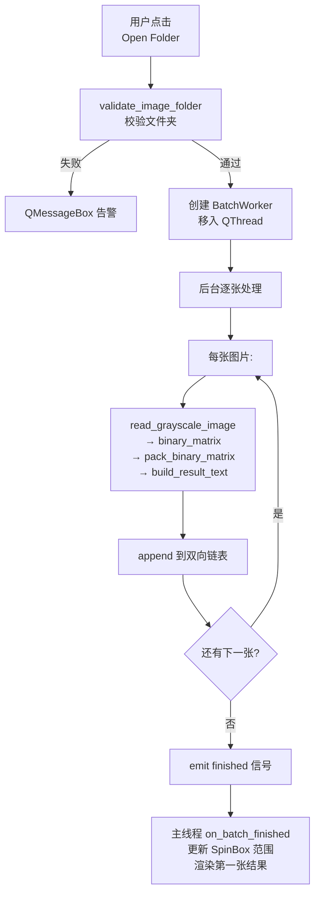
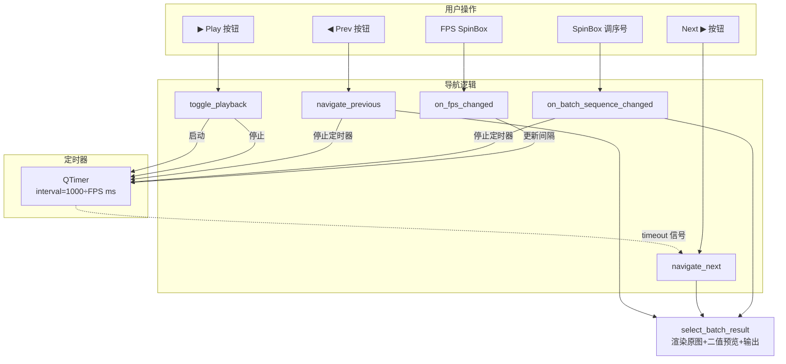
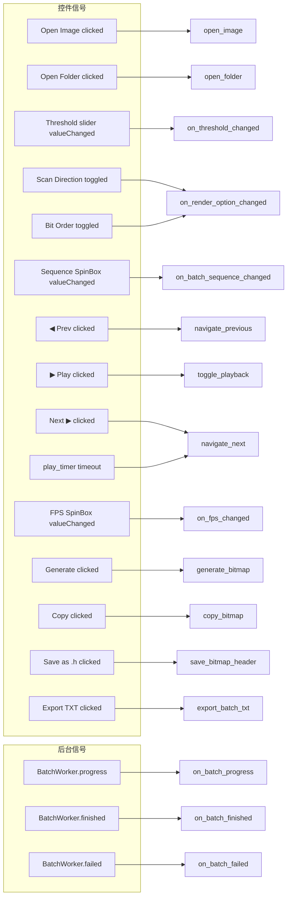
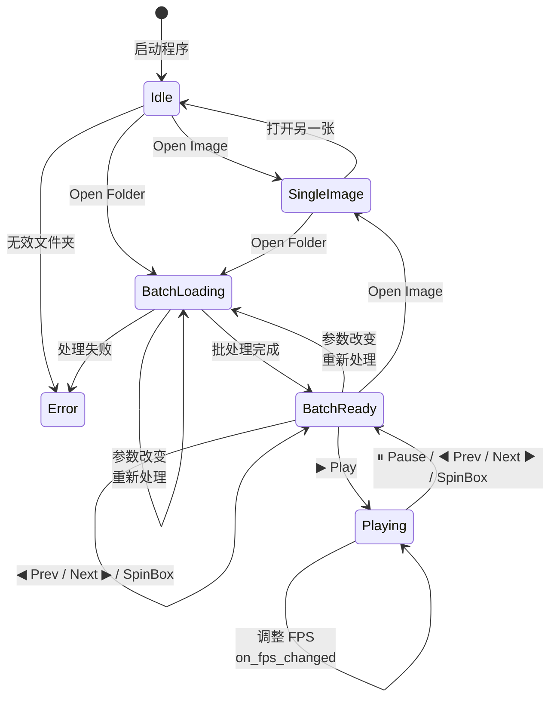
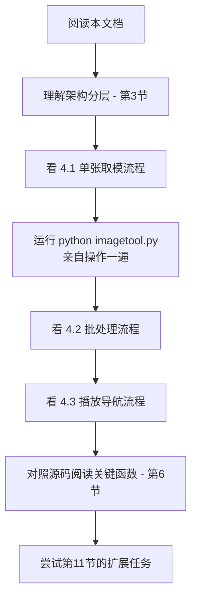
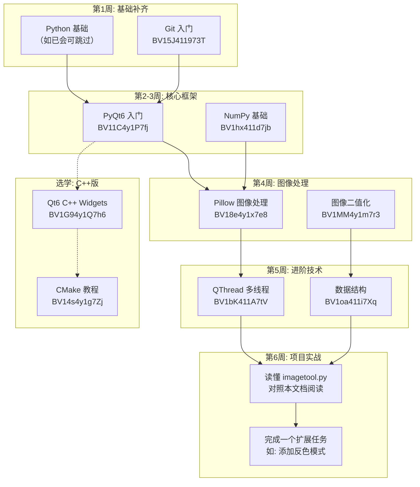

# Image,ool 项目知识清单,

> 面向新手的完整学习指南，涵盖架构、流程、依赖、代码结构及扩展方向。

---

## 1. 项目概览

```
ImageTool/
├── imagetool.py          ← ★ Python 版（主入口，当前活跃开发版本）
├── requirements.txt       ← Python 依赖
├── CMakeLists.txt         ← C++ 版构建脚本（Qt6/CMake）
├── LICENSE
├── README.md
├── src/                   ← C++ Qt 版源码（备选实现）
│   ├── main.cpp
│   ├── MainWindow.h
│   ├── MainWindow.cpp
│   ├── stb_image.h        ← 单头文件图片加载库
├── build/                 ← CMake 构建产物
├── docs/
│   ├── usage.md           ← 操作指南
│   └── technical.md       ← 技术文档
```

### 双版本说明

| 维度 | Python 版 (`imagetool.py`) | C++ Qt 版 (`src/`) |
|------|---------------------------|---------------------|
| 入口 | `python imagetool.py` | 需 CMake 编译后运行 |
| GUI 框架 | PyQt6 | Qt6 / Qt5 Widgets |
| 图片加载 | Pillow (PIL) | stb_image |
| 位运算加速 | NumPy `np.packbits` | C++ 手写位移 |
| 状态 | **活跃开发**（含全部最新功能） | 基础功能可用（有编译兼容性问题） |

---

## 2. 依赖清单

### Python 版

| 依赖 | 版本 | 用途 |
|------|------|------|
| Python | ≥3.8 | 运行时 |
| PyQt6 | ≥6.0 | GUI 框架 |
| Pillow | ≥9.0 | 图片读取与灰度转换 |
| NumPy | ≥1.20 | 向量化二值化 + 位打包 |

安装：
```bash
pip install PyQt6 Pillow numpy
```

### C++ 版

| 依赖 | 用途 |
|------|------|
| Qt6/Qt5 (Widgets) | GUI 框架 |
| CMake ≥3.16 | 构建系统 |
| stb_image.h（内嵌）| 图片加载 |

---

## 3. 架构分层

```mermaid
graph TB
    subgraph 入口层
        A[main()/__main__]
    end
    subgraph UI层
        B[ImageToolWindow<br/>QMainWindow]
        C[PreviewWidget<br/>QFrame 自制控件]
        D[BatchWorker<br/>QObject 后台线程]
    end
    subgraph 数据模型层
        E[DoublyLinkedResultList<br/>双向链表]
        F[BatchResult<br/>@dataclass]
        G[BatchNode<br/>链表节点]
    end
    subgraph 算法核心层
        H[read_grayscale_image]
        I[build_binary_matrix]
        J[pack_binary_matrix]
        K[format_bytes_per_line]
        L[build_result_text]
    end
    subgraph 工具函数层
        M[sanitize_identifier]
        N[compute_padded_size]
        O[validate_image_folder]
    end

    A --> B
    B --> C
    B --> D
    D --> E
    D --> F
    E --> G
    D --> H
    D --> I
    D --> J
    D --> K
    D --> L
    B --> H
    B --> I
    B --> J
    B --> K
    B --> L
    B --> M
    B --> N
    B --> O
```

---

## 4. 核心算法流程

### 4.1 图像取模完整流程（单张）


### 4.2 批处理流程



### 4.3 播放导航流程



### 4.4 信号槽全景图



---

## 5. 数据结构详解

### 5.1 BatchResult `@dataclass`

| 字段 | 类型 | 说明 |
|------|------|------|
| `index` | `int` | 序号 (1-based) |
| `source_path` | `str` | 原始文件绝对路径 |
| `file_name` | `str` | 文件名 |
| `result_text` | `str` | 完整 C 数组文本 |
| `gray_pixels` | `np.ndarray` | 灰度像素（一维，用于二次渲染） |
| `original_width` | `int` | 原始宽度 |
| `original_height` | `int` | 原始高度 |
| `padded_width` | `int` | 补齐后宽度 (8 的倍数) |
| `padded_height` | `int` | 补齐后高度 (8 的倍数) |
| `bytes_count` | `int` | 打包后的字节数 |

### 5.2 DoublyLinkedResultList — 双向链表

```
head → [Node#1] ⇄ [Node#2] ⇄ [Node#3] ← tail
          ↓           ↓           ↓
      BatchResult  BatchResult  BatchResult
```

- `append(data)` — O(1) 尾部追加
- `get(index)` — O(n) 按序号查找
- `iter_results()` — 生成器，O(n) 遍历全部
- `clear()` — O(1) 清空

> **设计原因**：批处理结果需要按序追加和随机访问。虽然 Python 的 `list` 也可实现，但双向链表是面试/学习中的经典数据结构实践。事实上用 `list` 替代可获 O(1) 随机访问，代码更简洁。

---

## 6. 关键函数速查

### 图片处理链

```
read_grayscale_image
    → (gray_pixels, width, height)
    → build_binary_matrix
        → (padded_width, padded_height, binary_matrix)
        → pack_binary_matrix
            → bytearray
            → build_result_text
                → C 数组字符串
```

### 函数签名与说明

| 函数 | 输入 | 输出 | 关键技术 |
|------|------|------|----------|
| `sanitize_identifier(text)` | 文件名 | 合法 C 标识符 | 正则/字符串过滤 |
| `compute_padded_size(w, h)` | 宽, 高 | (补齐宽, 补齐高) | `(n+7)//8*8` 向上取整 |
| `read_grayscale_image(fp)` | 文件路径 | (1D数组, 宽, 高) | PIL `convert("L")` |
| `build_binary_matrix(...)` | 灰度数组+阈值 | 二值矩阵 | NumPy 向量比较 |
| `pack_binary_matrix(...)` | 二值矩阵 | bytearray | `np.packbits` C 层打包 |
| `format_bytes_per_line(...)` | bytearray | 格式化文本 | 每 16 字节一行 |
| `build_result_text(...)` | bytearray+宏名 | C 数组完整文本 | 宏定义+数组声明 |
| `validate_image_folder(...)` | 文件夹路径 | (错误, 文件列表) | 型检验 |

---

## 7. UI 布局速查

```
┌────────────────────────┬──────────────────────────────┐
│     左侧面板 (left)     │      右侧面板 (right)         │
│                        │                              │
│ [Open Image][Open Folder]│  Threshold: ──●── 128      │
│                        │                              │
│ 图片信息: xxx.png      │  ┌──────────┬──────────┐    │
│                        │  │ Scan Dir │ Bit Order│    │
│ ┌──────────────────┐   │  │ ○ Horiz  │ ○ MSB    │    │
│ │                  │   │  │ ○ Vert   │ ○ LSB    │    │
│ │   原始图片预览    │   │  └──────────┴──────────┘    │
│ │                  │   │                              │
│ │                  │   │  ┌─ 二值点阵预览 ──────────┐ │
│ └──────────────────┘   │  │ ██░░██░░░░██░░          │ │
│                        │  └────────────────────────┘ │
│  ┌─ Batch ──────────────────────────────────────┐   │
│  │ Status: 30 images loaded                     │   │
│  │ [████████████████░░]  Progress               │   │
│  │ Sequence [ 1▼]  file_001.png                 │   │
│  │ [◀ Prev] [▶ Play] [Next ▶]  FPS [15▼]       │   │
│  │ Delimiter [\n\n-----\n\n            ]        │   │
│  │ [Export TXT]                                 │   │
│  └──────────────────────────────────────────────┘   │
│                        │                              │
│                        │ [Generate] [Copy] [Save .h]  │
│                        │ ┌──────────────────────────┐ │
│                        │ │ /* Source: xxx.png */    │ │
│                        │ │ #define IMG_WIDTH 64     │ │
│                        │ │ ...                      │ │
│                        │ └──────────────────────────┘ │
└────────────────────────┴──────────────────────────────┘
```

---

## 8. 状态机图解



---

## 9. 关键技术决策

| 决策 | 理由 |
|------|------|
| **NumPy 向量化二值化** | 避免 Python 逐像素循环，大图加速数十倍 |
| **`np.packbits` 位打包** | C 层原生实现，比 Python 位运算循环快 |
| **QThread 后台批处理** | 批处理不阻塞 UI，保持界面响应 |
| **blockSignals 防重入** | SpinBox 的 `valueChanged` 会误停播放定时器 |
| **双向链表存储结果** | 教学示例，实际可用 `list` 替代 |
| **预计算全部结果** | 切换序号时立即渲染，无需等待 |

---

## 10. 输出格式示例

```c
/* Source: icon.png */

#define IMG_WIDTH 64
#define IMG_HEIGHT 64
#define IMG_BYTES 512

const uint8_t bitmap[] = {
    /* 0x0000 */ 0xFF, 0x81, 0xBD, 0xA5, 0xA5, 0xBD, 0x81, 0xFF, 0x00, 0x7E, 0x42, 0x5A, 0x5A, 0x42, 0x7E, 0x00,
    /* 0x0010 */ 0x18, 0x3C, 0x7E, 0xFF, 0xFF, 0x7E, 0x3C, 0x18, 0x00, 0x00, 0x00, 0x00, 0x00, 0x00, 0x00, 0x00,
    ...
};
```

---

## 11. 新手扩展建议

| 难度 | 方向 | 涉及文件 | 说明 |
|------|------|----------|------|
| ⭐ | 添加反色模式 | `imagetool.py` | 在 `build_binary_matrix` 中加 `invert` 参数 |
| ⭐ | 支持更多图片格式 | `imagetool.py` | 在 `SUPPORTED_IMAGE_SUFFIXES` 中添加后缀 |
| ⭐⭐ | 自定义输出模板 | `imagetool.py` | 修改 `build_result_text`，支持不同宏命名规则 |
| ⭐⭐ | 预览区域缩放/拖拽 | `imagetool.py` | 给 `PreviewWidget` 添加 `wheelEvent` |
| ⭐⭐⭐ | 将双向链表替换为 `list` | `imagetool.py` | 简化数据结构，O(1) 随机访问 |
| ⭐⭐⭐ | 图片裁剪/旋转预处理 | 新增函数 | 在二值化之前加入 PIL 预处理步骤 |
| ⭐⭐⭐⭐ | 支持彩色模式（RGB565 等） | `imagetool.py` | 新增色彩格式选项，修改打包逻辑 |
| ⭐⭐⭐⭐⭐ | 修复 C++ 版 Qt 编译问题 | `src/` + `CMakeLists.txt` | 升级 GCC 或调整编译器标志 |

---

## 12. 常用命令

```bash
# Python 版 - 直接运行
python imagetool.py

# Python 版 - 安装依赖
pip install -r requirements.txt

# C++ 版 - 编译
cd build && cmake .. -G "MinGW Makefiles" && cmake --build . --config Debug

# 验证语法
python -c "import ast; ast.parse(open('imagetool.py').read()); print('OK')"
```

---

## 13. 学习路径建议



---

## 14. 项目知识点全景清单

本项目的全部知识点，按层级分类：

### 🟢 基础层 — 语言与工具

| 序号 | 知识点 | 涉及文件 | 说明 |
|------|--------|----------|------|
| 1 | Python 3 基础语法 | `imagetool.py` | 类型注解、f-string、生成器、dataclass |
| 2 | Git 版本控制 | 项目目录 | 代码管理、分支协作、commit 规范 |
| 3 | pip 包管理 / requirements.txt | `requirements.txt` | 依赖声明与安装 |
| 4 | C++17 标准 | `src/*.cpp` `CMakeLists.txt` | 现代 C++、auto、智能指针、enum class |
| 5 | MinGW / GCC 工具链 | `CMakeLists.txt` `build/` | 编译器标志、链接、ABI 兼容性 |

### 🟡 框架层 — GUI 与构建

| 序号 | 知识点 | 涉及文件 | 说明 |
|------|--------|----------|------|
| 6 | **PyQt6 Widgets** | `imagetool.py` | QMainWindow、QPushButton、QSlider、QLabel、QSpinBox、QTextEdit |
| 7 | **Qt 信号槽机制** | `imagetool.py` | `clicked.connect()`、`valueChanged`、`toggled`、跨线程信号 |
| 8 | **Qt 布局系统** | `imagetool.py` | QVBoxLayout、QHBoxLayout、QGridLayout、QGroupBox |
| 9 | **Qt 自定义控件** | `imagetool.py` | QFrame 子类化、paintEvent 重写、QPainter 绘制 |
| 10 | **QTimer 定时器** | `imagetool.py` | 周期性触发、start/stop、动态调间隔 |
| 11 | **QThread 多线程** | `imagetool.py` | Worker 模式、moveToThread、信号跨线程通信 |
| 12 | **CMake 构建系统** | `CMakeLists.txt` | find_package、AUTOMOC、target_link_libraries |
| 13 | **Qt6 C++ Widgets** | `src/MainWindow.h/.cpp` | Q_OBJECT、MOC、private slots、override |

### 🟠 算法层 — 图像处理

| 序号 | 知识点 | 涉及文件 | 说明 |
|------|--------|----------|------|
| 14 | **图像灰度化** | `imagetool.py` | PIL `Image.convert("L")`、NumPy uint8 数组 |
| 15 | **二值化（阈值法）** | `imagetool.py` | `gray >= threshold` 向量化比较、NumPy 广播 |
| 16 | **OTSU 大津法** | （可扩展）| 自适应阈值算法，参考文献中推荐 |
| 17 | **位打包 (bit packing)** | `imagetool.py` | `np.packbits`、8 像素→1 字节、MSB/LSB 位序 |
| 18 | **扫描方向变换** | `imagetool.py` | 横向扫描 vs 纵向扫描，矩阵转置 `.T` |
| 19 | **8 字节对齐补齐** | `imagetool.py` | `(n+7)//8*8` 公式、pad 到 8 的倍数 |
| 20 | **C 数组代码生成** | `imagetool.py` | 宏定义、`const uint8_t[]`、格式化输出 |
| 21 | **stb_image 图片加载** | `src/stb_image.h` | 单头文件 C 库、PNG/JPG/BMP 解码 |

### 🔵 数据结构层

| 序号 | 知识点 | 涉及文件 | 说明 |
|------|--------|----------|------|
| 22 | **双向链表** | `imagetool.py` | DoublyLinkedResultList、BatchNode |
| 23 | **Python dataclass** | `imagetool.py` | @dataclass、类型标注、自动 __init__ |
| 24 | **Python 生成器** | `imagetool.py` | `iter_results()` yield、惰性遍历 |
| 25 | **NumPy ndarray** | `imagetool.py` | reshape、tobytes、astype、dtype |
| 26 | **QVector / QByteArray** | `src/` | Qt 容器、C++ 动态数组 |

### 🟣 工程实践层

| 序号 | 知识点 | 涉及文件 | 说明 |
|------|--------|----------|------|
| 27 | **UI 状态机设计** | `imagetool.py` | Idle→Single→Batch→Playing 状态转换 |
| 28 | **防重入设计** | `imagetool.py` | blockSignals、batch_processing 标志位 |
| 29 | **前后端分离** | `imagetool.py` | UI线程 + 后台 Worker 线程模式 |
| 30 | **信号防抖** | `imagetool.py` | 参数变化→重新批处理，避免频繁重建 |
| 31 | **错误处理** | `imagetool.py` | try/except、QMessageBox、validate 校验 |
| 32 | **文件系统操作** | `imagetool.py` | pathlib.Path、QFileDialog、QDir |
| 33 | **AOT/MOC 元对象编译** | `build/ImageTool_autogen/` | Qt MOC 自动生成反射代码 |
| 34 | **编译器兼容性处理** | `CMakeLists.txt` | GCC 版本检测、条件编译、ABI 问题排查 |

---

## 15. B 站课程推荐与学习路线

### 📺 课程清单（按知识点匹配）

| 序号 | 知识领域 | 推荐 BV 号 | 课程名称 | 难度 |
|------|---------|-----------|---------|------|
| 1 | PyQt6 GUI | `BV11C4y1P7fj` | 2024版 PyQt6 桌面开发（无废话版） | ⭐⭐ |
| 2 | PySide6 GUI | `BV1c84y1N7iL` | PySide6 百炼成真 10h 入门 | ⭐⭐ |
| 3 | NumPy | `BV1hx411d7jb` | 数据分析 numpy/pandas/matplotlib | ⭐⭐ |
| 4 | Pillow 图像 | `BV18e4y1x7e8` | Pillow 库图像处理专题 | ⭐ |
| 5 | Qt6 C++ | `BV1G94y1Q7h6` | Qt6.3 C++ GUI 开发 20h 完整版 | ⭐⭐⭐ |
| 6 | CMake | `BV14s4y1g7Zj` | CMake 保姆级教程 3.5h | ⭐⭐ |
| 7 | Python 并发 | `BV1bK411A7tV` | 多线程/多进程/协程实战 | ⭐⭐⭐ |
| 8 | 位图取模 | `BV1Xo4y137nc` | OLED 汉字取模+程序讲解 | ⭐⭐ |
| 9 | 双向链表 | `BV1oa411i7Xq` | 数据结构：双向链表保姆级 | ⭐ |
| 10 | Git 教程 | `BV15J411973T` | 尚硅谷 Git 12h 完整版 | ⭐⭐ |
| 11 | 图像二值化 | `BV1MM4y1m7r3` | OTSU 大津法原理复现 | ⭐⭐⭐ |

### 🎯 推荐学习路线



### 📝 学习建议

1. **不要一口气看完所有课程** — 先看 PyQt6 前 3 集 + NumPy 前 2 集，就能开始读 `imagetool.py` 了
2. **边看边改代码** — 看完 Pillow 教程后，试着在 `imagetool.py` 中修改 `build_binary_matrix`，加入反色逻辑
3. **Git 在第 1 天就学** — `git init`、`git add`、`git commit` 三条命令足够起步
4. **C++ 版先搁置** — Python 版功能更完善且无编译问题，学完 Python 版后再挑战 C++ 版
5. **遇到 Bug 先看信号槽** — Qt 编程 80% 的 bug 出在信号连接上，检查 `connect()` 的参数类型是否匹配

---

> 文档版本：v1.1 | 最后更新：2026-06-14 | 新增 §14 知识点清单 + §15 B站课程推荐

